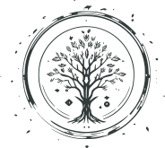

<p align="center">
  
  <h3 align="center">optimum</h3>
  <p align="center"><strong>client for managing data collections</strong></p>

  <p align="center">
    <!-- Version -->
    <a href="https://github.com/kshard/optimum/releases">
      
    </a>
    <!-- Documentation -->
    <a href="https://pkg.go.dev/github.com/kshard/optimum">
      
    </a>
    <!-- Build Status -->
    <a href="https://github.com/kshard/optimum/actions/">
      
    </a>
    <!-- GitHub -->
    <a href="http://github.com/kshard/optimum">
      
    </a>
    <!-- Coverage -->
    <a href="https://coveralls.io/github/kshard/optimum?branch=main">
      
    </a>
    <!-- Go Card -->
    <a href="https://goreportcard.com/report/github.com/kshard/optimum">
      
    </a>
  </p>
</p>

--- 

The library is provides Golang client and command line utility for managing data collection.

## Getting Started

- [Getting Started](#getting-started)
  - [Getting access](#getting-access)
  - [Create data collection](#create-data-collection)
    - [Hierarchical Navigable Small World](#hierarchical-navigable-small-world)
  - [List data collections](#list-data-collections)
  - [Writing data (batch)](#writing-data-batch)
    - [Hierarchical Navigable Small World](#hierarchical-navigable-small-world-1)
  - [Reading data](#reading-data)
    - [Hierarchical Navigable Small World](#hierarchical-navigable-small-world-2)
  - [Remove data collection](#remove-data-collection)
- [Using Golang library](#using-golang-library)
  - [Quick Example](#quick-example)
- [How To Contribute](#how-to-contribute)
  - [commit message](#commit-message)
  - [bugs](#bugs)
- [License](#license)


Install the command-line utility from source code:

```bash
go install github.com/kshard/optimum/cmd/optimum@latest
```

### Getting access

The command line utility requires access to remote server that provisions data structures for you. Contact your provided for details.


### Create data collection

Your data is organized into collections, referred to as _casks_. Each cask is implemented based on a specific data structure algorithm (class) and is assigned a unique name along with configuration properties. Casks are optimized for fast reads below 5 millisecond. 

```bash
optimum create -u $HOST -c class:cask -j path/to/config.json
```

The client support following data structure algorithms:

#### Hierarchical Navigable Small World

The algorithm `hnsw` is an efficient and scalable method for approximate nearest neighbor search in high-dimensional spaces.

```bash
optimum create -u $HOST -c hnsw:name -j path/to/config.json
```

Config algorithm through primary parameters to focus on includes `M`, `M0`, `efConstruction` and `surface` distance function. `M` and `M0` controls the maximum number of connections per node, balancing between memory usage and search efficiency. `efConstruction` determines the number of candidate nodes evaluated during graph construction, influencing both the construction time and the accuracy of the graph.

```json
{
  "m":  8,                // number in range of [4, 1024]
  "m0": 64,               // number in range of [4, 1024]
  "efConstruction": 200,  // number in range of [200, 1000]
  "surface": "cosine"     // enum {"cosine", "euclidean"}
}
```


### List data collections

List all data casks provisioned to your account. The utility fetches collections organized by their respective data structure algorithms.

```bash
optimum list -u $HOST -c class
```

Each cask is one of the state:
- UNAVAILABLE: the cask is not ready for use.
- PENDING: deployment or housekeeping is going on.
- ACTIVE: the cask is active, last deployment successfully completed.
- FAILED: the last deployment is failed.


### Writing data (batch)

The client supports only non-real-time data ingestion (batch intake), which consists of two phases: data upload followed by a commit.

```bash
# Upload data into server.
optimum upload -u $HOST -c class:cask path/to/data.txt

# Commit uploaded data, making it available online.
optimum commit -u $HOST -c class:cask
```

The client supports the following data formats, which vary depending on the data structure algorithms used: 

#### Hierarchical Navigable Small World

Textual formats are required to represent embedding vectors, with each line consisting of a key (not exceeding 32 bytes) and a vector.

```
key -0.37604 0.24116 ... -0.26098 -0.0079604
```


### Reading data

Use the REST API for any advanced reading use cases, as the client only supports basic operations.

```bash
optimum query -u $HOST -c class:cask path/to/query.txt
```

The client supports the following query formats, which vary depending on the data structure algorithms used: 

#### Hierarchical Navigable Small World

The query is equivalent to data format used for writing. Textual formats are required to represent embedding vectors, with each line consisting of a key (query ID) and a vector.

```
query -0.37604 0.24116 ... -0.26098 -0.0079604
```


### Remove data collection

The operation is irreversible and results in the permanent destruction of all data.

```bash
optimum remove -u $HOST -c class:cask
```


## Using Golang library

The latest version of the module is available at `main` branch. All development, including new features and bug fixes, take place on the `main` branch using forking and pull requests as described in contribution guidelines. The stable version is available via Golang modules.

Use `go get` to retrieve the library and add it as dependency to your application.

```bash
go get -u github.com/kshard/optimum
```

### Quick Example

The example below shows usage of client for Hierarchical Navigable Small World.

```go
package main

import (
  "github.com/kshard/optimum"
  "github.com/fogfish/gurl/v2/http"
  "github.com/fogfish/curie"
)

const (
  host = "https://example.com"
  cask = curie.IRI("hnsw:example")
)

func main() {
  // Create client
  api := optimum.New(
    http.New(),
    host,
  )

  // Query the data structure
  neighbors, err := api.Query(context.Background(), cask,
		optimum.Query{Query: []float32{0.1, 0.2, /* ... */ 0.128}},
	)
  
  // Print results
  fmt.Println("Nearest neighbors:", neighbors)
}
```


## How To Contribute

The library is [MIT](LICENSE) licensed and accepts contributions via GitHub pull requests:

1. Fork it
2. Create your feature branch (`git checkout -b my-new-feature`)
3. Commit your changes (`git commit -am 'Added some feature'`)
4. Push to the branch (`git push origin my-new-feature`)
5. Create new Pull Request

The build and testing process requires [Go](https://golang.org) version 1.21 or later.


### commit message

The commit message helps us to write a good release note, speed-up review process. The message should address two question what changed and why. The project follows the template defined by chapter [Contributing to a Project](http://git-scm.com/book/ch5-2.html) of Git book.

### bugs

If you experience any issues with the library, please let us know via [GitHub issues](https://github.com/kshard/optimum/issue). We appreciate detailed and accurate reports that help us to identity and replicate the issue. 


## License

[](LICENSE)

